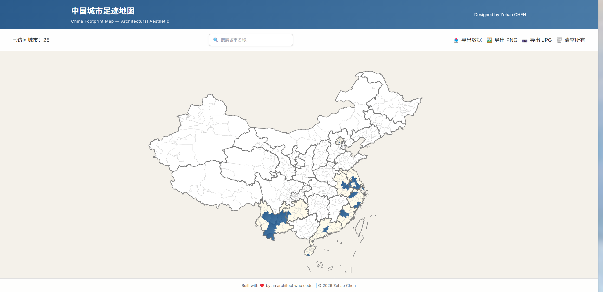

# 中国城市足迹地图 | China Footprint Map

> 交互式中国城市足迹记录，建筑师美学风格

## 功能



| 操作               | 说明                                                    |
| ------------------ | ------------------------------------------------------- |
| **点击城市**       | 点亮 / 取消点亮该城市（蓝色渐变填充）                   |
| **省级联动**       | 点亮某城市后，同省其余城市自动变为浅黄色背景            |
| **省界加粗**       | 叠加省级边界线，视觉区分更清晰                          |
| **城市搜索**       | 顶栏输入框输入城市名（支持模糊匹配），下拉选择即可点亮  |
| **导出 PNG / JPG** | 始终以完整全国地图为基准导出，不受当前缩放影响，2x 高清 |
| **导出数据**       | 将访问记录下载为 JSON 文件                              |
| **清空所有**       | 二次确认后清空全部记录                                  |
| **数据持久化**     | 所有记录自动保存至 LocalStorage，刷新后不丢失           |

---

## 技术栈

- **Vue 3** — Composition API
- **ECharts 5** — 地图可视化（`geo` 组件 + `lines` 省界叠加）
- **Vite** — 构建与开发服务器
- **Tailwind CSS** — 样式辅助

## 环境要求

| 工具 | 版本要求 | 说明 |
|---|---|---|
| **Node.js** | ≥ 18.0 | 运行时环境，[下载地址](https://nodejs.org/) |
| **npm** | ≥ 9.0 | 随 Node.js 一同安装 |

主要依赖版本（`package.json`）：

| 包 | 版本 |
|---|---|
| vue | ^3.4 |
| echarts | ^5.5 |
| vite | ^5.1 |
| tailwindcss | ^3.4 |

---

## 移植 / 部署

### 本地开发

```bash
# 1. 克隆仓库
git clone https://github.com/angle89/china_footprint_map.git
cd china_footprint_map

# 2. 安装依赖
npm install

# 3. 启动开发服务器
npm run dev
```

浏览器访问 `http://localhost:3000`

### 构建生产版本

```bash
npm run build      # 输出至 dist/
npm run preview    # 本地预览构建结果
```

`dist/` 目录可直接部署至任意静态托管服务，例如：

- **Vercel** / **Netlify**：连接 GitHub 仓库，自动检测 Vite 项目，构建命令 `npm run build`，输出目录 `dist`
- **GitHub Pages**：手动将 `dist/` 内容推送到 `gh-pages` 分支
- **Nginx / Apache**：将 `dist/` 内容复制到 Web 根目录即可

> **注意**：所有地图数据（`china_cities.json` / `china_provinces.json`）已内置于 `public/data/` 目录，无需外部 API 调用，离线可用。

---

## 数据来源

| 文件                   | 数据集                                                                           | 来源                                                                                |
| ---------------------- | -------------------------------------------------------------------------------- | ----------------------------------------------------------------------------------- |
| `china_cities.json`    | 中国地级市边界 GeoJSON，475 个城市，含 `adcode`、`province`、`provinceCode` 属性 | [阿里云 DataV GeoAtlas](https://datav.aliyun.com/portal/school/atlas/area_selector) |
| `china_provinces.json` | 中国省级行政区划边界 GeoJSON，含完整省界坐标                                     | [阿里云 DataV GeoAtlas](https://datav.aliyun.com/portal/school/atlas/area_selector) |

两份数据均通过 `https://geo.datav.aliyun.com/areas_v3/bound/` API 获取，遵循阿里云 DataV 数据使用协议。

---

## 数据格式

LocalStorage key: china_footprint_data

```json
{
  "visitedCities": [
    {
      "name": "南京市",
      "adcode": "320100",
      "visitDate": "2026-02-24T10:30:00.000Z",
      "notes": ""
    }
  ],
  "lastUpdated": "2026-02-24T10:30:00.000Z"
}
```
